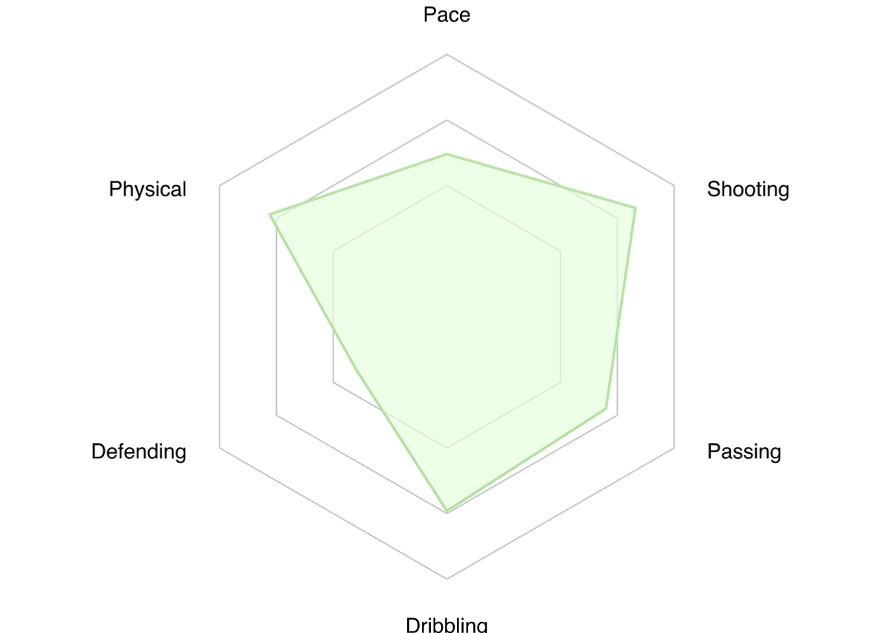

# Attribute n-gons

Simple utility to generate attribute n-gons (also referred to as radars).

``` console
npm i t-ski/attribute-ngons
```

> Generates SVG and PNG.

``` console
npx attr-ngon ./data.json [./out]?
```

<sub><code>data.json</code></sub>
``` json
[
  {
    "attribute": "Pace",
    "degree": 0.62
  },
  {
    "attribute": "Shooting",
    "degree": 0.83
  },
  {
    "attribute": "Passing",
    "degree": 0.7
  },
  …
]
```

> Attribute titles are required to contain only encoded HTML entities (~~`UI & UX`~~ → `UI &amp; UX`).



##

<sub>&copy; Thassilo Martin Schiepanski</sub>